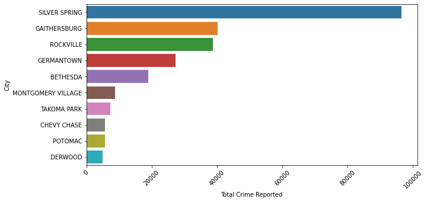
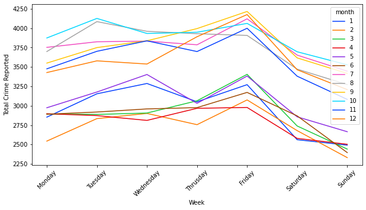
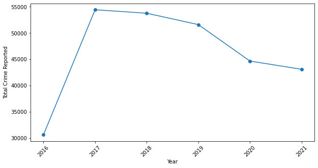
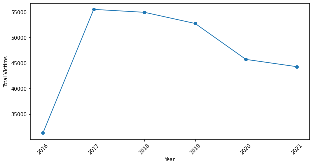
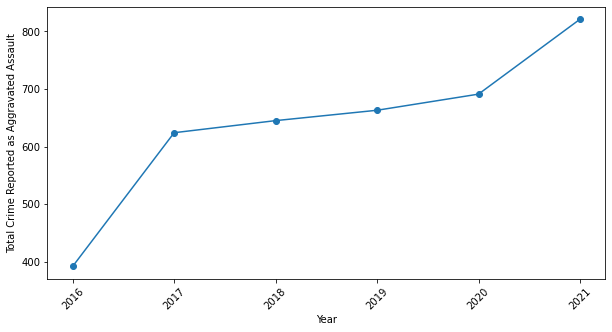
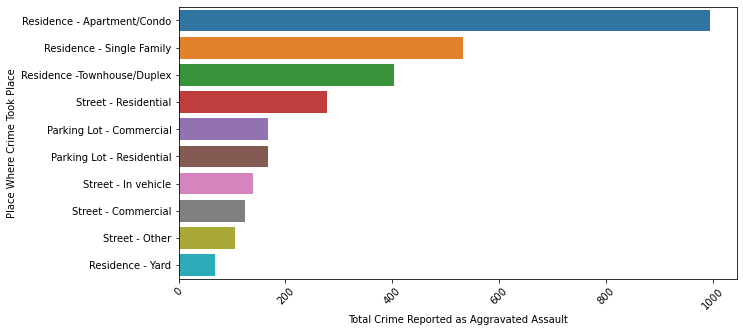

## Introduction
As stated by Arthur Conan Doyle "To revenge crime is important, but to prevent it is more so". The main objective of this study is to analyse crime and gain valuable insights from the same to curb them from taking place. To achieve the objectives, reported crime from Montgomery County is used to perform analysis. Montgomery is Maryland's most populated county and one of the wealthiest in the country. In this project, I have built an ETL pipeline to programitically consume and wrangle unstructured data from the Montgomery data portal. At the end, the data is analysed to understand the nature and trend of the crime in Montgomery county. Python libraries such as Matplotlib and Seaborn are used to present the insights. 

## Steps to run the project

1. Setup the MongoDB using the docker by running the command: docker-compose up --build -d mongodb 
2. For this project, the postgres was installed on the local system. Database, Username and Password can be changed from 
config.py file. For this project, Database is 'postgres', Username is 'postgres' and Password is '1234'
3. Activate the virtual environment by using the command for windows: dapproject\Scripts\activate.bat and for MacOS: source dapproject/bin/activate
5. Install the required libraries from requirements.txt using the command: pip install -r requirements.txt
6. run the main.py file using the command: python main.py 

## Results
As per the data provided by Montgomery County, the county has seen all kinds of crimes, from shoplifting, and theft to rape, murder, and human trafficking. Figure 1 shows the top ten cities with the highest number of reported crimes with Silver Spring at the top.
top10cities

|:--:|
|<b>Top 10 cities by reported crime - Fig.1</b>|

Throughout the year, the data shows a gradual increase in the number of reported crimes with some variation from Monday till Thursday then a sudden spike on Friday followed by a downfall till Sunday as shown in figure 2. If we would look at the total number of crimes reported year by year shown in figure 3, there is a sudden increase in the reported crimes from 2016 to 2017. This is because we only have six months of data for 2016. After 2017, there is a gradual decrease in the crimes reported till 2019. In 2020, Covid 19 pandemic hit us all hard because of which the number of crimes reported dropped drastically compared to 2019. As a result, a downfall in the crimes reported is seen from 2019 to 2021. 

|:--:|
|<b>Reported crimes per week - Fig.2</b>|

|:--:|
|<b>Reported crimes per year - Fig.3</b>|

The plot shown in figure 4 shows the total number of victims of crime for each year from 2016 to 2021. It also shows a pattern similar to that of the total number of crime reported each year, a gradual decrease till 2019 and then a sudden downfall from 2020 till 2021.

|:--:|
|<b>Victims of crime per year - Fig.4</b>|

Even though the total number of reported crimes has seen a downfall in the county because of the pandemic, one crime ASSAULT - AGGRAVATED, in particular, has increased in the past couple of years. Especially during the pandemic, reported crimes classified as aggravated assault has increased drastically from 2020 to 2021. After digging a little deeper into the dataset, most of these crimes have taken place at a residential place as shown in figure 6. One of the reasons for this could be the lockdown in the country during a pandemic. Most of the people were at home during the pandemic. Therefore, it might have increased aggravated assaults at a residential place.

|:--:|
|<b>Reported crime assualt per year - Fig.5</b>|

|:--:|
|<b>Top 10 places by reported crime assualt - Fig.6</b>|

